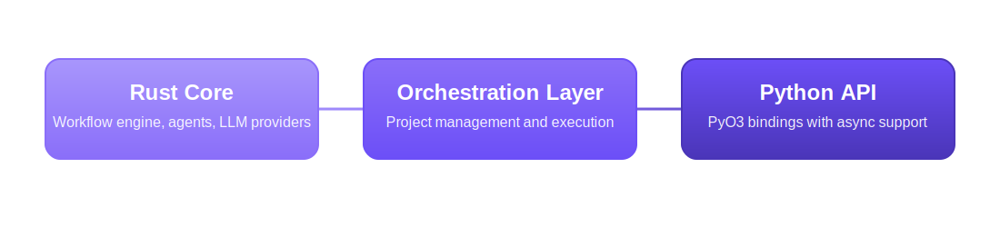

<div align="center">

# GraphBit - High Performance Agentic Framework

<p align="center">
    
</p>

<!-- Added placeholders for links, fill it up when the corresponding links are available. -->
<p align="center">
    <a href="https://graphbit.ai/">Website</a> | 
    <a href="https://docs.graphbit.ai/">Docs</a> |
    <a href="https://discord.com/invite/huVJwkyu">Discord</a>
    <br /><br />
</p>

[](https://github.com/InfinitiBit/graphbit/actions/workflows/update-docs.yml)
[](https://github.com/InfinitiBit/graphbit/blob/main/CONTRIBUTING.md)
[](https://www.rust-lang.org)
[](https://www.python.org)

**Type-Safe AI Agent Workflows with Rust Performance**

</div>

Graphbit is an **industry-grade agentic AI framework** built for developers and AI teams that demand stability, scalability, and low resource usage. 

Written in **Rust** for maximum performance and safety, it delivers up to **68× lower CPU usage** and **140× lower memory** footprint than certain leading alternatives while consistently using far fewer resources than the rest, all while maintaining comparable throughput and execution speed. See [benchmarks](benchmarks/report/framework-benchmark-report.md) for more details.

Designed to run **multi-agent workflows in parallel**, Graphbit persists memory across steps, recovers from failures, and ensures **100% task success** under load. Its lightweight, resource-efficient architecture enables deployment in both **high-scale enterprise environments** and **low-resource edge scenarios**. With built-in observability and concurrency support, Graphbit eliminates the bottlenecks that slow decision-making and erode ROI. 

##  Key Features

- **Tool Selection** - LLMs intelligently select tools based on descriptions
- **Type Safety** - Strong typing throughout the execution pipeline
- **Reliability** - Circuit breakers, retry policies, and error handling
- **Multi-LLM Support** - OpenAI, Anthropic, OpenRouter, DeepSeek, Ollama
- **Resource Management** - Concurrency controls and memory optimization
- **Observability** - Built-in metrics and execution tracing

##  Quick Start

### Installation
Clone the repository
```bash
git clone https://github.com/InfinitiBit/graphbit.git
cd graphbit
```

Install Rust
- **Linux/macOS**: 
```bash
curl --proto '=https' --tlsv1.2 -sSf https://sh.rustup.rs | sh && source $HOME/.cargo/env
```  
- **Windows**: Download & run [rustup-init.exe](https://win.rustup.rs/x86_64)  

Install Poetry
```bash
curl -sSL https://install.python-poetry.org | python3 -
```

Set up poetry environment, then install dependencies
```bash
poetry env use python3.11   # Supports from python 3.10 to 3.13
source $(poetry env info --path)/bin/activate
poetry install --no-root
```

Build from source
```bash
cargo build --release
```

Build Python bindings
```bash
cd python/
maturin develop --release
```

### Environment Setup
First, set up your API keys:
```bash
export OPENAI_API_KEY=your_openai_api_key_here
export ANTHROPIC_API_KEY=your_anthropic_api_key_here
```

> **Security Note**: Never commit API keys to version control. Always use environment variables or secure secret management.

### Basic Usage
```python
import os

from graphbit import LlmConfig, Executor, Workflow, Node, tool

# Initialize and configure
config = LlmConfig.openai(os.getenv("OPENAI_API_KEY"), "gpt-4o-mini")

# Create executor
executor = Executor(config)

# Create tools with clear descriptions for LLM selection
@tool(_description="Get current weather information for any city")
def get_weather(location: str) -> dict:
    return {"location": location, "temperature": 22, "condition": "sunny"}

@tool(_description="Perform mathematical calculations and return results")
def calculate(expression: str) -> str:
    return f"Result: {eval(expression)}"

# Build workflow
workflow = Workflow("Analysis Pipeline")

# Create agent nodes
smart_agent = Node.agent(
    name="Smart Agent",
    prompt="What's the weather in Paris and calculate 15 + 27?",
    system_prompt="You are an assistant skilled in weather lookup and math calculations. Use tools to answer queries accurately.",
    tools=[get_weather, calculate]
)

processor = Node.agent(
    name="Data Processor",
    prompt="Process the results obtained from Smart Agent.",
    system_prompt="""You process and organize results from other agents.

    - Summarize and clarify key points
    - Structure your output for easy reading
    - Focus on actionable insights
    """
)

# Connect and execute
id1 = workflow.add_node(smart_agent)
id2 = workflow.add_node(processor)
workflow.connect(id1, id2)

result = executor.execute(workflow)
print(f"Workflow completed: {result.is_success()}")
print("\nSmart Agent Output: \n", result.get_node_output("Smart Agent"))
print("\nData Processor Output: \n", result.get_node_output("Data Processor"))
```

## High-Level Architecture

<p align="center">
  
</p>

Three-tier design for reliability and performance:
- **Rust Core** - Workflow engine, agents, and LLM providers
- **Orchestration Layer** - Project management and execution
- **Python API** - PyO3 bindings with async support

## Python API Integrations

GraphBit provides a rich Python API for building and integrating agentic workflows, including executors, nodes, LLM clients, and embeddings. For the complete list of classes, methods, and usage examples, see the [Python API Reference](docs/api-reference/python-api.md).

## Contributing to GraphBit

We welcome contributions. To get started, please see the [Contributing](CONTRIBUTING.md) file for development setup and guidelines.

GraphBit is built by a wonderful community of researchers and engineers.

<a href="https://github.com/InfinitiBit/graphbit/graphs/contributors">
  
</a>
