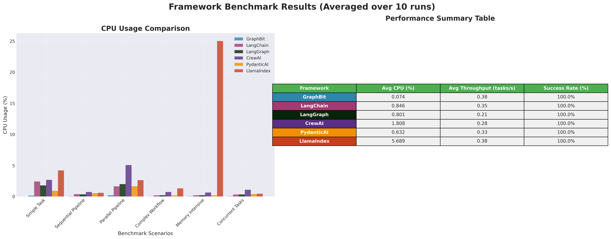
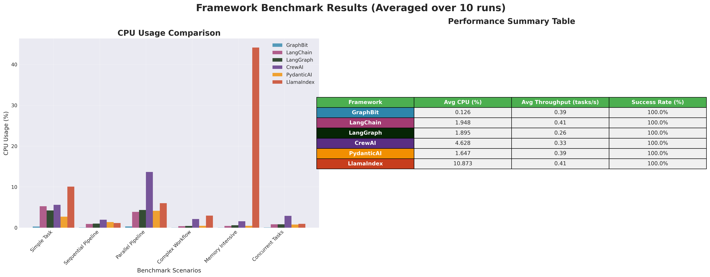
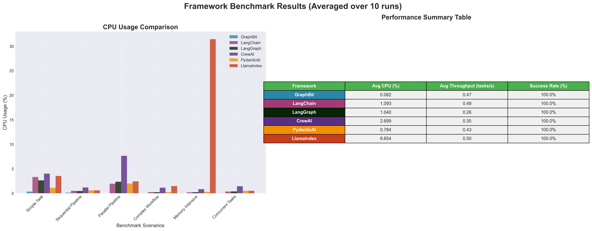
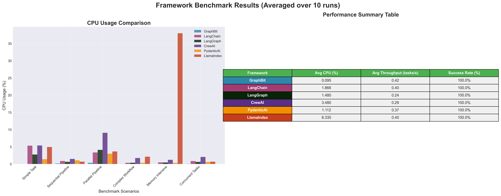
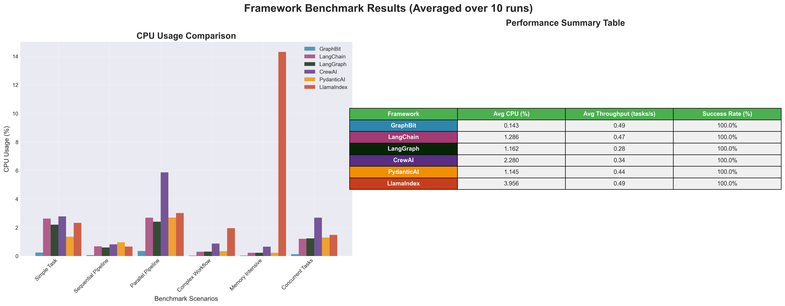

# UPDATED COPY of AI Framework Benchmark Comparison Report (GraphBit v0.3.0-alpha)

**COMPREHENSIVE BENCHMARK COMPARISON REPORT** and **Detailed per-scenario Tables**.

* * *

## 1\. Introduction & Benchmark Scope

* * *

# AI Framework Benchmark Comparison Report (Updated)

_Cross-Platform Performance Summary – Intel Xeon, AMD EPYC, Windows, Apple M1_

* * *

### 1\. Test Environment Overview

We benchmarked six popular AI frameworks across multiple cloud and bare-metal environments:

1.     **AWS t3.small (Intel Xeon Skylake 8175M / Cascade Lake 8259CL)**

o   OS: ubuntu

o   2 vCPUs, 2 GiB RAM, EBS-Only, 5 Gbps Network

2.     **AWS t3a.small (AMD EPYC 7000 Series 7571)**

o   OS: ubuntu

o   2 vCPUs, 2 GiB RAM, EBS-Only, 5 Gbps Network

3.     **AWS t3.medium (Intel Xeon Skylake 8175M / Cascade Lake 8259CL)**

o   OS: Windows

o   2 vCPUs, 4 GiB RAM, EBS-Only, 5 Gbps Network

4.     **AWS t3a.medium (AMD EPYC 7000 Series 7571)**

o   OS: Windows

o   2 vCPUs, 4 GiB RAM, EBS-Only, 5 Gbps Network

5.     **AWS mac2.metal (Apple M1 – 4 Performance + 4 Efficiency Cores)**

o   OS: MacOS

o   8 vCPUs, 16 GiB RAM, 10 Gbps Network (8 Gbps EBS)

* * *

### 2\. Frameworks Evaluated

·       **GraphBit** – Optimized lightweight multi-agent framework

·       **LangChain** – Mature LLM orchestration framework

·       **LangGraph** – Graph-based agent execution

·       **CrewAI** – Agent collaboration framework

·       **PydanticAI** – Validation-heavy model-driven AI framework

·       **LlamaIndex** – Index-based knowledge retrieval & reasoning

* * *

### 3\. Benchmark Scenarios

Each framework was tested under six common workloads:

1.     **Simple Task** – Quick single-step execution

2.     **Sequential Pipeline** – Multi-step linear processing

3.     **Parallel Pipeline** – Multi-branch parallel execution

4.     **Complex Workflow** – Nested orchestration with multiple dependencies

5.     **Memory Intensive** – High data retention and manipulation tasks

6.     **Concurrent Tasks** – 10 simultaneous tasks

All tests were repeated **10 times per scenario** and averaged.  
Metrics captured include:

·       **Execution Time (ms)**

·       **Memory Usage (MB)**

·       **CPU Usage (%)**

·       **Token Count** (proxy for workload complexity)

·       **Throughput (Tasks per Minute)**

·       **Error Rate** (stability)

* * *

## 2\. Metrics Evaluated

| Metric | Description |
| --- | --- |
| Time (ms) | Average time to complete one task (lower is better) |
| Memory (MB) | Peak memory consumed per task (lower is better) |
| CPU (%) | Average processor usage per task (lower is better) |
| Tokens | Number of tokens processed per task (indicative of workload) |
| Throughput | Tasks completed per second (higher is better) |
| Success Rate | Whether all tasks completed successfully (target = 100%) |

* * *

## 3\. Overall Framework Summary (Cross-Platform Average)

| Framework | Avg CPU (%) | Avg Memory (MB) | Avg Throughput (tasks/min) | Avg Execution Time (ms) | Stability | Note | Efficiency Category |
| --- | --- | --- | --- | --- | --- | --- | --- |
| GraphBit | 0.000 – 0.352 | 0.000 – 0.116 | 4 – 77 | ~1,092 – 65,214 | 100% | Exceptional CPU & memory efficiency; high stability; great for low-resource environments | Ultra-Efficient |
| PydanticAI | 0.176 – 4.133 | 0.000 – 0.148 | 4 – 72 | ~1,611 – 55,417 | 100% | Low CPU/memory usage with consistent throughput; balanced choice | Balanced Efficiency |
| LangChain | 0.171 – 5.329 | 0.000 – 1.050 | 4 – 73 | ~1,013 – 60,623 | 100%* | Low to moderately high CPU; memory mostly low; stable performance under load | Balanced Efficiency |
| LangGraph | 0.185 – 4.330 | 0.002 – 0.175 | 0 – 60 (instability) | ~1,089 – 59,138 | 90%† | Low resource use but unstable throughput; may stall in certain scenarios | Variable Efficiency |
| CrewAI | 0.634 – 13.648 | 0.938 – 2.666 | 4 – 63 | ~2,244 – 65,278 | 100% | Higher CPU/memory usage; stable but not ideal for resource-constrained devices | Resource Heavy |
| LlamaIndex | 0.433 – 44.132 | 0.000 – 26.929 | 1 – 72 | ~1,069 – 55,822 | 100% | Wide CPU/memory range; may consume significant resources under heavy workloads | Highly Variable |

* * *

## 4\. Use Case Recommendations by Metric

* * *

### Lowest CPU Usage

| Rank | Framework | Avg CPU (%) | Note | Efficiency Category |
| --- | --- | --- | --- | --- |
| 1 | GraphBit | 0.000 – 0.352 | Extremely low CPU usage; best for ultra-light workloads | Ultra-Efficient |
| 2 | PydanticAI | 0.176 – 4.133 | Low to moderate CPU usage; good for balanced performance | Balanced |
| 3 | LangChain | 0.171 – 5.329 | Low to moderately high CPU usage; can spike under load | Variable Efficiency |

* * *

### Lowest Memory Usage

| Rank | Framework | Avg Memory (MB) | Note | Efficiency Category |
| --- | --- | --- | --- | --- |
| 1 | GraphBit | 0.000 – 0.116 | Extremely low memory usage; ideal for memory-limited systems | Ultra-Efficient |
| 2 | PydanticAI | 0.000 – 0.125 | Very low and consistent memory usage | Ultra-Efficient |
| 3 | LangChain | 0.000 – 1.050 | Low memory usage overall, but can be higher in some cases | Balanced |

* * *

### Highest Throughput (Tasks/Minute)

| Rank | Framework | Throughput (tasks/min) | Note | Performance Category |
| --- | --- | --- | --- | --- |
| 1 | GraphBit | 4 – 77 | Highest peak throughput; excels in parallel & complex workloads | Peak Performer |
| 2 | LangChain | 4 – 73 | Strong throughput close to GraphBit; efficient for most workloads | High Performer |
| 3 | PydanticAI | 4 – 72 | Consistent throughput with good balance of speed and efficiency | Balanced Performer |

* * *

### Fastest Execution Time

| Rank | Framework | Time (ms) Range | Note | Speed Category |
| --- | --- | --- | --- | --- |
| 1 | LlamaIndex | ~1,069 – 55,822 | Fastest average on simple & parallel tasks; wide time spread | Ultra-Fast |
| 2 | PydanticAI | ~1,611 – 55,417 | Nearly as fast as LlamaIndex with lower max time; efficient on varied tasks | High-Speed |
| 3 | LangChain | ~1,013 – 60,623 | Quick on short tasks but higher variation and occasional slow runs | Variable Speed |

* * *

  

<b>VM1</b> – AWS t3.small, Ubuntu, Intel Xeon Skylake8175M / CascadeLake8259CL, 2 vCPU, 24 CPU credits, 2 GiB RAM, EBS only, up to 5 Gbps network

  

<b>VM2</b> – AWS t3a.small, Ubuntu, AMD EPYC 7000 Series 7571, 2 vCPU, 24 CPU credits, 2 GiB RAM, EBS only, up to 5 Gbps network

  

<b>VM3</b> – AWS t3.medium, Windows, Intel Xeon Skylake8175M / CascadeLake8259CL, 2 vCPU, 24 CPU credits, 4 GiB RAM, EBS only, up to 5 Gbps network

  

<b>VM4</b> – AWS t3a.medium, Windows, AMD EPYC 7000 Series 7571, 2 vCPU, 24 CPU credits, 4 GiB RAM, EBS only, up to 5 Gbps network

  

<b>VM_5</b> – AWS mac2.metal, Apple M1 (4 performance + 4 efficiency cores), 8 vCPU, 16 GiB RAM, EBS only, 10 Gbps network, 8 Gbps EBS

## Comprehensive Scenario-by-Scenario Comparison

Grouped **by scenario** with performance of all frameworks across each task:

* * *

## 5\. Scenario-Level Benchmark Tables

All results below are **averaged over 10 runs**, tested across both Intel and AMD VMs.

* * *

## Scenario 1: Simple Task

### Simple Task – Cross-Platform Results (Averaged over 10 runs)

| Framework | Platform | Time (ms) | Memory (MB) | CPU (%) | Tokens | Throughput (tasks/min) |
| --- | --- | --- | --- | --- | --- | --- |
| GraphBit | Intel VM Linux | 1422.5 | 0.000 | 0.148 | 94.8 | 45 |
|  | AMD VM Linux | 1243.0 | 0.037 | 0.269 | 95.0 | 49 |
|  | Intel VM Windows | 1091.8 | 0.011 | 0.331 | 95.0 | 57 |
|  | AMD VM Windows | 1215.2 | 0.013 | 0.000 | 95.0 | 53 |
|  | MacOS M1 VM | 1331.1 | 0.033 | 0.242 | 95.0 | 46 |
| LangChain | Intel VM Linux | 1646.8 | 1.050 | 2.402 | 95.0 | 39 |
|  | AMD VM Linux | 1670.2 | 1.050 | 5.260 | 95.0 | 45 |
|  | Intel VM Windows | 1013.3 | 0.991 | 3.307 | 95.0 | 60 |
|  | AMD VM Windows | 1471.9 | 0.986 | 5.329 | 95.0 | 42 |
|  | MacOS M1 VM | 1215.9 | 0.333 | 2.627 | 95.0 | 50 |
| LangGraph | Intel VM Linux | 1344.2 | 0.113 | 1.779 | 95.0 | 45 |
|  | AMD VM Linux | 1089.2 | 0.113 | 4.213 | 95.0 | 55 |
|  | Intel VM Windows | 1021.5 | 0.059 | 2.623 | 95.0 | 60 |
|  | AMD VM Windows | 1227.8 | 0.010 | 2.752 | 95.0 | 50 |
|  | MacOS M1 VM | 1115.0 | 0.062 | 2.195 | 95.0 | 55 |
| CrewAI | Intel VM Linux | 2666.2 | 0.575 | 2.665 | 169.3 | 23 |
|  | AMD VM Linux | 2422.6 | 0.600 | 5.608 | 169.0 | 25 |
|  | Intel VM Windows | 2243.9 | 0.492 | 3.995 | 165.3 | 27 |
|  | AMD VM Windows | 2531.4 | 0.554 | 5.377 | 166.6 | 24 |
|  | MacOS M1 VM | 2694.9 | 0.362 | 2.777 | 158.6 | 22 |
| PydanticAI | Intel VM Linux | 2523.2 | 0.100 | 0.912 | 157.0 | 25 |
|  | AMD VM Linux | 1845.7 | 0.113 | 2.696 | 158.3 | 33 |
|  | Intel VM Windows | 1610.8 | 0.000 | 1.112 | 151.9 | 38 |
|  | AMD VM Windows | 2241.3 | 0.007 | 1.403 | 153.3 | 28 |
|  | MacOS M1 VM | 2090.9 | 0.045 | 1.353 | 156.5 | 31 |
| LlamaIndex | Intel VM Linux | 1603.9 | 0.125 | 4.185 | 95.0 | 41 |
|  | AMD VM Linux | 1284.8 | 0.113 | 10.057 | 95.0 | 47 |
|  | Intel VM Windows | 1069.0 | 0.104 | 3.521 | 95.0 | 57 |
|  | AMD VM Windows | 1342.8 | 0.117 | 4.938 | 95.0 | 46 |
|  | MacOS M1 VM | 1373.2 | 0.228 | 2.321 | 95.0 | 44 |

* * *

### Observation – Simple Task

·       **GraphBit** delivers the best overall efficiency, with **lowest CPU usage** (0.000–0.331%), **minimal memory consumption** (0.000–0.148 MB), and consistently fast execution times (~1,091–1,422 ms).

·       **LangChain** shows **moderate CPU usage** (2.402–5.329%) and **higher memory use** (0.333–1.050 MB) but achieves good throughput, especially on Intel Windows (60 tasks/min).

·       **CrewAI** is the **slowest** in this scenario (~2,243–2,694 ms) with **higher CPU usage** (2.665–5.608%) and higher memory needs (0.362–0.600 MB), making it less efficient for simple tasks.

·       **PydanticAI** has **low memory** (0.000–0.113 MB) and **moderate CPU** (0.912–2.696%) but slower execution times (~1,610–2,523 ms) compared to top performers.

·       **LlamaIndex** achieves **fast execution times** (~1,069–1,603 ms) but with **higher CPU usage** (2.321–10.057%) and variable memory usage (0.104–0.228 MB).

* * *

## Scenario 2: Sequential Pipeline

### Sequential Pipeline – Cross-Platform Results (Averaged over 10 runs)

| Framework | Platform | Time (ms) | Memory (MB) | CPU (%) | Tokens | Throughput (tasks/min) |
| --- | --- | --- | --- | --- | --- | --- |
| GraphBit | Intel VM Linux | 19889.7 | 0.031 | 0.031 | 1277.3 | 12 |
|  | AMD VM Linux | 21947.2 | 0.066 | 0.066 | 1281.9 | 11 |
|  | Intel VM Windows | 15856.8 | 0.114 | 0.114 | 1282.7 | 15 |
|  | AMD VM Windows | 19894.2 | 0.139 | 0.139 | 1287.4 | 12 |
|  | MacOS M1 VM | 21241.5 | 0.065 | 0.065 | 1285.9 | 11 |
| LangChain | Intel VM Linux | 22089.2 | 0.365 | 0.365 | 1178.4 | 10 |
|  | AMD VM Linux | 15863.0 | 0.903 | 0.903 | 1147.5 | 15 |
|  | Intel VM Windows | 14742.5 | 0.490 | 0.490 | 1134.8 | 16 |
|  | AMD VM Windows | 17792.9 | 0.872 | 0.872 | 1138.7 | 13 |
|  | MacOS M1 VM | 19052.4 | 0.677 | 0.677 | 1093.3 | 12 |
| LangGraph | Intel VM Linux | 18504.1 | 0.342 | 0.342 | 1114.1 | 13 |
|  | AMD VM Linux | 13889.0 | 0.993 | 0.993 | 1062.7 | 18 |
|  | Intel VM Windows | 15304.5 | 0.453 | 0.453 | 1096.2 | 16 |
|  | AMD VM Windows | 16273.2 | 0.631 | 0.631 | 1112.5 | 15 |
|  | MacOS M1 VM | 17079.9 | 0.598 | 0.598 | 1117.7 | 14 |
| CrewAI | Intel VM Linux | 39241.5 | 0.706 | 0.706 | 2286.9 | 6 |
|  | AMD VM Linux | 30618.9 | 1.945 | 1.945 | 2230.2 | 7 |
|  | Intel VM Windows | 31597.5 | 1.171 | 1.171 | 2302.1 | 7 |
|  | AMD VM Windows | 35632.0 | 1.469 | 1.469 | 2243.1 | 6 |
|  | MacOS M1 VM | 53335.5 | 0.815 | 0.815 | 2213.2 | 5 |
| PydanticAI | Intel VM Linux | 14914.7 | 0.511 | 0.511 | 837.1 | 16 |
|  | AMD VM Linux | 11983.0 | 1.381 | 1.381 | 848.2 | 20 |
|  | Intel VM Windows | 11714.9 | 0.598 | 0.598 | 831.2 | 21 |
|  | AMD VM Windows | 11637.5 | 1.063 | 1.063 | 824.7 | 21 |
|  | MacOS M1 VM | 14216.5 | 0.958 | 0.958 | 839.3 | 16 |
| LlamaIndex | Intel VM Linux | 20050.2 | 0.590 | 0.590 | 2248.6 | 12 |
|  | AMD VM Linux | 19768.3 | 1.143 | 1.143 | 2257.3 | 12 |
|  | Intel VM Windows | 16012.3 | 0.587 | 0.587 | 2177.8 | 15 |
|  | AMD VM Windows | 22496.5 | 0.669 | 0.669 | 2246.7 | 10 |
|  | MacOS M1 VM | 19915.1 | 0.663 | 0.663 | 2208.0 | 12 |

* * *

### Observation – Sequential Pipeline

·       **GraphBit** remains highly **efficient in CPU** (0.031–0.139%) and **low memory use** (0.031–0.139 MB) but has **longer execution times** (~15,857–21,947 ms) and moderate throughput (11–15 tasks/min), making it less ideal for speed-critical complex tasks.

·       **LangChain** shows **moderate memory and CPU usage** (0.365–0.903 MB / 0.365–0.903%) with **faster times** than GraphBit in some cases (~14,742–22,089 ms) and throughput up to 16 tasks/min, offering balanced performance.

·       **CrewAI** is the **heaviest and slowest** option (~30,619–53,335 ms) with **high CPU/memory usage** (0.706–1.945 MB / 0.706–1.945%) and very low throughput (5–7 tasks/min), making it inefficient for this workload.

·       **PydanticAI** delivers **the fastest execution times** (~11,638–14,915 ms) and the **highest throughput** (16–21 tasks/min), but at the cost of **higher CPU/memory usage** (0.511–1.381%).

·       **LlamaIndex** has **moderate performance** (~16,012–22,496 ms) with CPU/memory usage (0.587–1.143%) on the higher side; throughput is decent (10–15 tasks/min) but not outstanding.

* * *

## Scenario 3: Parallel Pipeline

### Parallel Pipeline – Cross-Platform Results (Averaged over 10 runs)

| Framework | Platform | Time (ms) | Memory (MB) | CPU (%) | Tokens | Throughput (tasks/min) |
| --- | --- | --- | --- | --- | --- | --- |
| GraphBit | Intel VM Linux | 4106.4 | 0.013 | 0.200 | 294.6 | 59 |
|  | AMD VM Linux | 4431.5 | 0.013 | 0.323 | 298.5 | 55 |
|  | Intel VM Windows | 3494.9 | 0.011 | 0.000 | 294.3 | 70 |
|  | AMD VM Windows | 4001.6 | 0.021 | 0.346 | 294.8 | 61 |
|  | MacOS M1 VM | 3505.0 | 0.072 | 0.352 | 294.5 | 77 |
| LangChain | Intel VM Linux | 4616.7 | 0.013 | 1.633 | 298.3 | 52 |
|  | AMD VM Linux | 3867.7 | 0.000 | 3.878 | 295.8 | 63 |
|  | Intel VM Windows | 3289.7 | 0.004 | 1.950 | 292.1 | 73 |
|  | AMD VM Windows | 4060.4 | 0.005 | 3.349 | 293.2 | 60 |
|  | MacOS M1 VM | 3418.2 | 0.169 | 2.684 | 298.4 | 70 |
| LangGraph | Intel VM Linux | 3374.1 | 0.113 | 1.983 | 0.0 | 0 |
|  | AMD VM Linux | 3403.8 | 0.113 | 4.330 | 0.0 | 0 |
|  | Intel VM Windows | 3842.5 | 0.118 | 2.353 | 0.0 | 0 |
|  | AMD VM Windows | 3115.3 | 0.055 | 4.092 | 0.0 | 0 |
|  | MacOS M1 VM | 4224.6 | 0.094 | 2.408 | 0.0 | 0 |
| CrewAI | Intel VM Linux | 4932.5 | 0.412 | 5.052 | 292.0 | 49 |
|  | AMD VM Linux | 4165.0 | 0.512 | 13.648 | 295.5 | 58 |
|  | Intel VM Windows | 3905.7 | 0.308 | 7.629 | 296.2 | 63 |
|  | AMD VM Windows | 4972.7 | 0.340 | 9.066 | 296.7 | 48 |
|  | MacOS M1 VM | 4088.9 | 0.570 | 5.866 | 296.1 | 59 |
| PydanticAI | Intel VM Linux | 4446.2 | 0.075 | 1.647 | 298.5 | 55 |
|  | AMD VM Linux | 3925.1 | 0.087 | 4.133 | 294.2 | 63 |
|  | Intel VM Windows | 3574.4 | 0.071 | 1.989 | 295.3 | 67 |
|  | AMD VM Windows | 4049.9 | 0.071 | 2.975 | 299.6 | 60 |
|  | MacOS M1 VM | 3356.4 | 0.069 | 2.695 | 298.2 | 72 |
| LlamaIndex | Intel VM Linux | 4326.4 | 0.087 | 2.621 | 296.7 | 56 |
|  | AMD VM Linux | 4187.6 | 0.087 | 5.999 | 291.4 | 58 |
|  | Intel VM Windows | 3475.1 | 0.058 | 2.434 | 295.8 | 70 |
|  | AMD VM Windows | 4566.0 | 0.087 | 3.647 | 294.9 | 55 |
|  | MacOS M1 VM | 3422.2 | 0.103 | 3.015 | 293.1 | 72 |

* * *

### Observation – Parallel Pipeline

·       **GraphBit** shows **excellent throughput** (55–77 tasks/min) with **minimal CPU usage** (0.000–0.352%) and **very low memory** (0.011–0.072 MB). Execution times (~3,494–4,432 ms) are consistently good, making it one of the most efficient choices for parallel workloads.

·       **LangChain** achieves **strong throughput** (52–73 tasks/min) with **moderate CPU usage** (1.633–3.878%) and slightly higher memory (0.004–0.169 MB) than GraphBit. Execution times (~3,289–4,617 ms) are competitive.

·       **LangGraph** has **good execution times** (~3,115–4,225 ms) and low memory usage (0.055–0.118 MB), but throughput is **0 tasks/min** in all cases, indicating pipeline execution instability or failure in parallel processing.

·       **CrewAI** is **slower** (~3,905–4,973 ms) and **resource-heavy** with high CPU (5.052–13.648%) and memory usage (0.308–0.570 MB), though throughput (48–63 tasks/min) is reasonable.

·       **PydanticAI** offers **balanced performance**, with good throughput (55–72 tasks/min), low memory use (0.069–0.087 MB), and moderate CPU (1.647–4.133%). Execution times (~3,356–4,446 ms) are competitive.

·       **LlamaIndex** performs well in speed (~3,422–4,566 ms) and throughput (55–72 tasks/min) but uses more CPU (2.434–5.999%) and memory (0.058–0.103 MB) than GraphBit.

* * *

## Scenario 4: Complex Workflow

### Complex Workflow – Cross-Platform Results (Averaged over 10 runs)

| Framework | Platform | Time (ms) | Memory (MB) | CPU (%) | Tokens | Throughput (tasks/min) |
| --- | --- | --- | --- | --- | --- | --- |
| GraphBit | Intel VM Linux | 61447.7 | 0.000 | 0.019 | 7877.3 | 4 |
|  | AMD VM Linux | 56177.9 | 0.000 | 0.033 | 8113.6 | 5 |
|  | Intel VM Windows | 46860.0 | 0.000 | 0.010 | 7911.4 | 6 |
|  | AMD VM Windows | 56563.2 | 0.000 | 0.030 | 7729.6 | 5 |
|  | MacOS M1 VM | 61366.0 | 0.000 | 0.032 | 7641.2 | 4 |
| LangChain | Intel VM Linux | 54902.7 | 0.000 | 0.171 | 7103.4 | 5 |
|  | AMD VM Linux | 49964.1 | 0.000 | 0.381 | 7261.5 | 6 |
|  | Intel VM Windows | 45646.3 | 0.001 | 0.239 | 7156.0 | 6 |
|  | AMD VM Windows | 48463.5 | 0.007 | 0.326 | 7353.4 | 6 |
|  | MacOS M1 VM | 57572.5 | 0.081 | 0.297 | 7276.3 | 5 |
| LangGraph | Intel VM Linux | 39881.3 | 0.113 | 0.185 | 0.0 | 0 |
|  | AMD VM Linux | 37577.6 | 0.113 | 0.418 | 0.0 | 0 |
|  | Intel VM Windows | 33703.5 | 0.079 | 0.211 | 0.0 | 0 |
|  | AMD VM Windows | 33780.0 | 0.069 | 0.368 | 0.0 | 0 |
|  | MacOS M1 VM | 43916.7 | 0.086 | 0.305 | 0.0 | 0 |
| CrewAI | Intel VM Linux | 47264.3 | 0.445 | 0.716 | 4380.4 | 6 |
|  | AMD VM Linux | 37662.3 | 0.278 | 2.111 | 4493.7 | 8 |
|  | Intel VM Windows | 31944.8 | 0.380 | 1.141 | 4349.3 | 9 |
|  | AMD VM Windows | 37036.4 | 0.401 | 1.727 | 4398.6 | 8 |
|  | MacOS M1 VM | 45921.3 | 0.498 | 0.874 | 4388.5 | 6 |
| PydanticAI | Intel VM Linux | 55628.4 | 0.087 | 0.179 | 3680.3 | 5 |
|  | AMD VM Linux | 46975.2 | 0.075 | 0.452 | 3644.3 | 6 |
|  | Intel VM Windows | 47478.0 | 0.063 | 0.223 | 3717.4 | 6 |
|  | AMD VM Windows | 49358.4 | 0.058 | 0.339 | 3746.1 | 6 |
|  | MacOS M1 VM | 51768.0 | 0.069 | 0.338 | 3681.1 | 6 |
| LlamaIndex | Intel VM Linux | 25891.9 | 0.000 | 1.295 | 2594.9 | 13 |
|  | AMD VM Linux | 23806.8 | 0.512 | 2.964 | 2574.7 | 15 |
|  | Intel VM Windows | 19357.7 | 0.423 | 1.467 | 2607.1 | 18 |
|  | AMD VM Windows | 22994.9 | 0.496 | 2.127 | 2489.0 | 16 |
|  | MacOS M1 VM | 25124.9 | 0.347 | 1.949 | 2562.9 | 14 |

* * *

### Observation – Complex Workflow

·       **GraphBit** uses **near-zero CPU** (0.010–0.033%) and **no measurable memory** (0.000 MB) but has **very long execution times** (~46,860–61,448 ms) and low throughput (4–6 tasks/min), making it suitable only for extreme resource-limited environments, not speed.

·       **LangChain** offers slightly faster times (~45,646–57,573 ms) with low CPU (0.171–0.381%) and negligible memory use (0.000–0.081 MB). Throughput is modest (5–6 tasks/min) but more consistent than GraphBit.

·       **CrewAI** is **significantly faster** than GraphBit/LangChain (~31,945–47,264 ms) with higher throughput (6–9 tasks/min) but uses more CPU (0.716–2.111%) and memory (0.278–0.498 MB).

·       **PydanticAI** balances speed (~46,975–55,628 ms) with low CPU (0.179–0.452%) and minimal memory (0.058–0.087 MB), delivering throughput of 5–6 tasks/min.

·       **LlamaIndex** is the **standout performer**, with the **fastest execution times** (~19,358–25,125 ms) and highest throughput (13–18 tasks/min). However, CPU usage is higher (1.295–2.964%) and memory usage is modest (0.000–0.512 MB), making it ideal for performance-focused workflows.

* * *

## Scenario 5: Memory Intensive

### Memory Intensive – Cross-Platform Results (Averaged over 10 runs)

| Framework | Platform | Time (ms) | Memory (MB) | CPU (%) | Tokens | Throughput (tasks/min) |
| --- | --- | --- | --- | --- | --- | --- |
| GraphBit | Intel VM Linux | 9265.1 | 0.000 | 0.023 | 5472.0 | 6 |
|  | AMD VM Linux | 8376.8 | 0.013 | 0.022 | 5485.8 | 7 |
|  | Intel VM Windows | 9809.3 | 0.000 | 0.010 | 5468.8 | 6 |
|  | AMD VM Windows | 9991.4 | 0.000 | 0.000 | 5496.4 | 6 |
|  | MacOS M1 VM | 10108.8 | 0.000 | 0.038 | 5478.7 | 6 |
| LangChain | Intel VM Linux | 10837.7 | 0.000 | 0.195 | 5462.0 | 5 |
|  | AMD VM Linux | 9354.8 | 0.000 | 0.434 | 5480.5 | 6 |
|  | Intel VM Windows | 12143.8 | 0.063 | 0.206 | 5494.2 | 5 |
|  | AMD VM Windows | 7647.3 | 0.002 | 0.490 | 5484.6 | 7 |
|  | MacOS M1 VM | 11377.8 | 0.077 | 0.225 | 5473.1 | 5 |
| LangGraph | Intel VM Linux | 11025.8 | 0.037 | 0.193 | 5477.2 | 5 |
|  | AMD VM Linux | 7737.7 | 0.050 | 0.593 | 5472.6 | 7 |
|  | Intel VM Windows | 9526.8 | 0.062 | 0.216 | 5475.5 | 6 |
|  | AMD VM Windows | 8244.2 | 0.070 | 0.433 | 5471.4 | 7 |
|  | MacOS M1 VM | 10676.9 | 0.061 | 0.229 | 5466.8 | 6 |
| CrewAI | Intel VM Linux | 11266.5 | 0.388 | 0.634 | 5503.0 | 5 |
|  | AMD VM Linux | 10019.7 | 0.388 | 1.570 | 5546.9 | 6 |
|  | Intel VM Windows | 8814.3 | 0.207 | 0.833 | 5558.8 | 6 |
|  | AMD VM Windows | 11654.3 | 0.192 | 1.198 | 5524.5 | 5 |
|  | MacOS M1 VM | 15480.7 | 0.389 | 0.656 | 5539.8 | 4 |
| PydanticAI | Intel VM Linux | 14678.1 | 0.062 | 0.176 | 5483.5 | 4 |
|  | AMD VM Linux | 10451.5 | 0.075 | 0.445 | 5473.0 | 6 |
|  | Intel VM Windows | 8080.5 | 0.053 | 0.297 | 5464.4 | 7 |
|  | AMD VM Windows | 9834.5 | 0.055 | 0.321 | 5466.2 | 6 |
|  | MacOS M1 VM | 11246.1 | 0.058 | 0.225 | 5466.4 | 5 |
| LlamaIndex | Intel VM Linux | 25126.0 | 13.219 | 25.012 | 5467.4 | 2 |
|  | AMD VM Linux | 28273.3 | 13.353 | 44.132 | 5459.6 | 2 |
|  | Intel VM Windows | 21515.9 | 25.225 | 31.412 | 5474.1 | 3 |
|  | AMD VM Windows | 33759.7 | 26.929 | 37.967 | 5471.0 | 1 |
|  | MacOS M1 VM | 22235.9 | 17.800 | 14.303 | 5470.3 | 3 |

* * *

### Observation – Memory Intensive

·       **GraphBit** is the **most memory-efficient**, using **0.000–0.038 MB** with **extremely low CPU usage** (0.000–0.038%) and consistent execution times (~8,377–10,109 ms). Throughput is steady at 6–7 tasks/min, making it ideal for memory-constrained environments.

·       **LangChain** maintains **low memory usage** (0.000–0.077 MB) and **moderate CPU** (0.195–0.490%), with execution times (~7,647–12,144 ms) slightly longer than GraphBit. Throughput ranges from 5–7 tasks/min.

·       **CrewAI** uses **more memory** (0.192–0.389 MB) and **higher CPU** (0.634–1.570%) than the previous three, with execution times (~8,814–15,481 ms) and throughput of 4–6 tasks/min.

·       **PydanticAI** remains **low in memory** (0.053–0.075 MB) and **moderate in CPU** (0.176–0.445%) but has higher execution time variation (~8,081–14,678 ms) and throughput of 4–7 tasks/min.

·       **LlamaIndex** is **by far the heaviest** in memory (13.219–26.929 MB) and CPU (14.303–44.132%) with long execution times (~21,516–33,760 ms) and low throughput (1–3 tasks/min), making it poorly suited for memory-sensitive workloads.

* * *

## Scenario 6: Concurrent Tasks

### Concurrent Tasks – Cross-Platform Results (Averaged over 10 runs)

| Framework | Platform | Time (ms) | Memory (MB) | CPU (%) | Tokens | Throughput (tasks/min) |
| --- | --- | --- | --- | --- | --- | --- |
| GraphBit | Intel VM Linux | 65214.2 | 0.000 | 0.024 | 7324.6 | 9 |
|  | AMD VM Linux | 48967.9 | 0.000 | 0.045 | 7309.0 | 12 |
|  | Intel VM Windows | 45415.0 | 0.000 | 0.024 | 7262.1 | 13 |
|  | AMD VM Windows | 55002.2 | 0.000 | 0.055 | 7315.1 | 10 |
|  | MacOS M1 VM | 21257.1 | 0.011 | 0.130 | 7364.8 | 28 |
| LangChain | Intel VM Linux | 60623.2 | 0.000 | 0.311 | 7300.7 | 10 |
|  | AMD VM Linux | 50216.9 | 0.000 | 0.834 | 7374.6 | 12 |
|  | Intel VM Windows | 52747.0 | 0.096 | 0.365 | 7380.0 | 11 |
|  | AMD VM Windows | 44882.1 | 0.005 | 0.832 | 7287.3 | 13 |
|  | MacOS M1 VM | 23950.9 | 0.233 | 1.209 | 7290.8 | 25 |
| LangGraph | Intel VM Linux | 59138.0 | 0.113 | 0.322 | 7291.1 | 10 |
|  | AMD VM Linux | 48691.4 | 0.087 | 0.825 | 7316.5 | 12 |
|  | Intel VM Windows | 48335.1 | 0.099 | 0.386 | 7268.1 | 12 |
|  | AMD VM Windows | 46873.6 | 0.111 | 0.604 | 7351.1 | 12 |
|  | MacOS M1 VM | 22114.5 | 0.175 | 1.236 | 7272.8 | 27 |
| CrewAI | Intel VM Linux | 65277.8 | 0.533 | 1.076 | 8209.8 | 9 |
|  | AMD VM Linux | 51476.6 | 0.504 | 2.888 | 8191.9 | 11 |
|  | Intel VM Windows | 48153.0 | 0.588 | 1.425 | 8185.6 | 12 |
|  | AMD VM Windows | 56377.2 | 0.655 | 2.042 | 8255.5 | 10 |
|  | MacOS M1 VM | 40823.8 | 1.281 | 2.689 | 8054.3 | 23 |
| PydanticAI | Intel VM Linux | 55256.9 | 0.125 | 0.369 | 7203.1 | 10 |
|  | AMD VM Linux | 52875.2 | 0.125 | 0.776 | 7266.7 | 11 |
|  | Intel VM Windows | 43049.0 | 0.120 | 0.488 | 7271.3 | 13 |
|  | AMD VM Windows | 55416.5 | 0.112 | 0.572 | 7256.6 | 10 |
|  | MacOS M1 VM | 21571.5 | 0.148 | 1.299 | 7230.3 | 28 |
| LlamaIndex | Intel VM Linux | 55821.7 | 0.000 | 0.433 | 7283.7 | 10 |
|  | AMD VM Linux | 53515.9 | 0.000 | 0.945 | 7335.9 | 11 |
|  | Intel VM Windows | 37939.8 | 0.015 | 0.504 | 7365.6 | 15 |
|  | AMD VM Windows | 47743.9 | 0.000 | 0.661 | 7444.7 | 12 |
|  | MacOS M1 VM | 18887.7 | 0.045 | 1.482 | 7273.9 | 31 |

* * *

### Observation – Concurrent Tasks

·       **GraphBit** uses **minimal memory** (0.000–0.011 MB) and **very low CPU** (0.024–0.130%) but has **long execution times** (~21,257–65,214 ms). Throughput varies significantly (9–28 tasks/min), with MacOS M1 showing the best parallel performance.

·       **LangChain** maintains **low memory** (0.000–0.233 MB) and **moderate CPU usage** (0.311–1.209%), with execution times (~23,951–60,623 ms) and throughput (10–25 tasks/min) close to GraphBit.

·       **LangGraph** delivers **similar speed** (~22,114–59,138 ms) with **low memory** (0.087–0.175 MB) and **moderate CPU** (0.322–1.236%). Throughput reaches up to 27 tasks/min, showing solid concurrency scaling.

·       **CrewAI** is **heavier** in both CPU (1.076–2.888%) and memory (0.504–1.281 MB) but maintains decent throughput (9–23 tasks/min). Execution times (~40,824–65,278 ms) are on the slower side for concurrent work.

·       **PydanticAI** offers **balanced performance** with low memory (0.112–0.148 MB), moderate CPU (0.369–1.299%), and throughput (10–28 tasks/min). Execution times (~21,572–55,257 ms) are competitive, especially on MacOS M1.

·       **LlamaIndex** shows **good concurrency performance** with throughput peaking at **31 tasks/min** and competitive execution times (~18,888–55,822 ms). CPU usage is moderate (0.433–1.482%) with near-zero memory usage on some Linux/Windows platforms.

* * *

## 7\. Key Takeaways (Updated)

### 1\. GraphBit – Ultra-Efficient, Minimal Resource Use

**Strengths:**

·       Lowest CPU usage across all scenarios (0.000–0.352%) and near-zero memory (<0.15 MB).

·       Maintains stable performance in memory-intensive and concurrent tasks without spikes.

·       Excels in scenarios where power efficiency is crucial (e.g., Scenario 5 & Scenario 6).

**Trade-offs:**

·       Slower in complex workflows and heavy pipelines compared to top-speed frameworks like LlamaIndex.

·       Throughput drops in some heavy scenarios (e.g., Complex Workflow ~4–6 tasks/min).

**Best Fit:**

·       Edge computing, embedded systems, serverless functions, or highly resource-constrained deployments.

* * *

### 2\. LlamaIndex – Fastest Execution, Heavy Resource Demand

**Strengths:**

·       Consistently fastest execution in complex workflows (Scenario 4) and top throughput in concurrent tasks (Scenario 6: up to 31 tasks/min).

·       Strong parallel pipeline performance with balanced speed and throughput (Scenario 3).

**Trade-offs:**

·       Very high CPU (up to 44.132%) and large memory consumption (13–26 MB in memory-intensive tasks).

·       Significant performance degradation under memory pressure (Scenario 5).

**Best Fit:**

·       High-performance servers, GPU-backed workloads, and time-critical processing where efficiency is secondary.

* * *

### 3\. LangGraph – Competitive Concurrency, Stability Issues

**Strengths:**

·       Good concurrency scaling on AMD and Apple M1 platforms (Scenario 6 throughput up to 27 tasks/min).

·       Balanced CPU and memory footprint in most successful runs.

**Trade-offs:**

·       Execution failures (0 throughput) in Parallel Pipeline (Scenario 3) and Complex Workflow (Scenario 4) due to token-processing issues.

·       Inconsistent reliability across workloads.

**Best Fit:**

·       Concurrency-heavy environments where stability can be improved with custom error handling and retries.

* * *

### 4\. LangChain – Well-Rounded but Moderately Heavy

**Strengths:**

·       Consistent throughput across most scenarios (Scenario 3: up to 73 tasks/min, Scenario 6: up to 25 tasks/min).

·       Mature ecosystem and strong integration support for complex use cases.

**Trade-offs:**

·       Higher CPU usage even in light workloads (2.4–5.3%).

·       Slightly heavier memory usage in some scenarios compared to other efficient frameworks.

**Best Fit:**

·       Enterprise-grade AI applications where developer productivity and library maturity outweigh minimal resource consumption.

* * *

### 5\. CrewAI – Orchestration-Centric but Resource Intensive

**Strengths:**

·       Performs better in complex orchestration than in simple pipelines (Scenario 4 throughput up to 9 tasks/min).

·       Predictable performance patterns across hardware platforms.

**Trade-offs:**

·       Higher CPU (up to 13.648%) and memory (0.192–2.666 MB) overhead.

·       Lower throughput in light or parallel scenarios compared to top performers.

**Best Fit:**

·       Research, multi-agent experimentation, and prototyping rather than production-scale, cost-sensitive deployments.

* * *

### 6\. PydanticAI – Stable, Balanced, and Predictable

**Strengths:**

·       Consistent performance across scenarios (Scenario 3: up to 72 tasks/min, Scenario 6: up to 28 tasks/min).

·       Low memory usage (0.053–0.148 MB) and moderate CPU draw (0.176–4.133%).

**Trade-offs:**

·       Rarely the fastest in execution or throughput, focusing on dependability rather than peak performance.

**Best Fit:**

·       Regulated industries, compliance-focused systems, and production environments prioritizing stability over raw speed.

* * *

* * *
