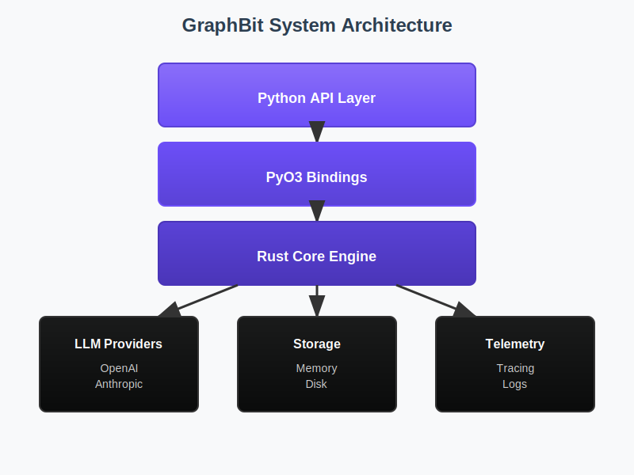
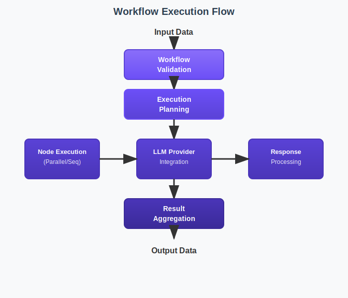
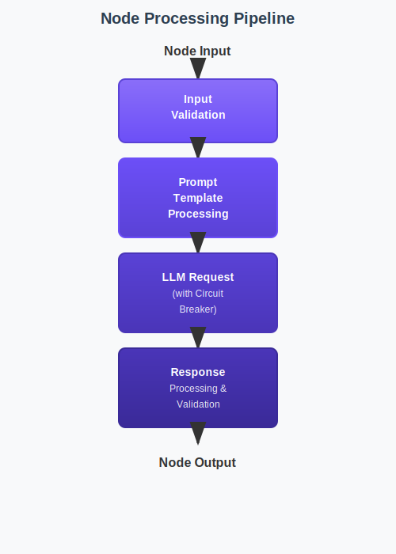

# Architecture Overview

GraphBit is a high-performance AI agent workflow automation framework built with a three-tier architecture that combines the performance of Rust with the accessibility of Python.

## System Architecture



## Core Components

### 1. Python API Layer

The Python API provides a user-friendly interface for creating and managing workflows:

```python
# High-level Python interface
from graphbit import init, Workflow, Executor

init()
builder = Workflow("My Workflow")
# ... build workflow
executor = Executor(config)
result = executor.execute(workflow)
```

**Key Classes:**
- `Workflow` - Fluent workflow construction
- `Executor` - Workflow execution engine
- `Node` - Node creation and management
- `LlmConfig` - LLM provider configuration

### 2. PyO3 Bindings Layer

PyO3 provides seamless interoperability between Python and Rust with production-grade features:

```rust
// Python class exposed via PyO3
#[pyclass]
pub struct LlmClient {
    provider: Arc<RwLock<Box<dyn LlmProviderTrait>>>,
    circuit_breaker: Arc<CircuitBreaker>,
    config: ClientConfig,
    stats: Arc<RwLock<ClientStats>>,
}

#[pymethods]
impl LlmClient {
    #[new]
    fn new(config: LlmConfig, debug: Option<bool>) -> PyResult<Self> {
        // Production-grade initialization with error handling
    }
    
    fn complete(&self, prompt: String, max_tokens: Option<i64>, temperature: Option<f64>) -> PyResult<String> {
        // High-performance completion with resilience patterns
    }
}
```

**Key Features:**
- **Type Safety**: Comprehensive input validation and type checking
- **Memory Management**: Proper resource cleanup across language boundaries
- **Error Handling**: Structured error types mapped to Python exceptions
- **Async Support**: Full async/await compatibility with Tokio runtime
- **Performance**: Zero-copy operations and optimized data structures
- **Observability**: Built-in metrics, tracing, and health monitoring

**Module Structure:**
- `lib.rs`: Global initialization and system management
- `runtime.rs`: Optimized Tokio runtime management
- `errors.rs`: Comprehensive error handling and conversion
- `llm/`: LLM provider integration with resilience patterns
- `embeddings/`: Embedding provider support
- `workflow/`: Workflow execution engine
- `validation.rs`: Input validation utilities

### 3. Rust Core Engine

The Rust core provides high-performance execution and reliability:

```rust
// Core workflow execution
pub struct WorkflowExecutor {
    /// Registered agents - use RwLock for better read performance
    agents: Arc<RwLock<HashMap<crate::types::AgentId, Arc<dyn AgentTrait>>>>,
    /// Simplified concurrency management system
    concurrency_manager: Arc<ConcurrencyManager>,
    /// Maximum execution time per node in milliseconds
    max_node_execution_time_ms: Option<u64>,
    /// Whether to fail fast on first error or continue with other nodes
    fail_fast: bool,
    /// Default retry configuration for all nodes
    default_retry_config: Option<RetryConfig>,
    /// Circuit breakers per agent to prevent cascading failures - use RwLock for better performance
    circuit_breakers: Arc<RwLock<HashMap<crate::types::AgentId, CircuitBreaker>>>,
    /// Global circuit breaker configuration
    circuit_breaker_config: CircuitBreakerConfig,
    /// Default LLM configuration for auto-generated agents
    default_llm_config: Option<crate::llm::LlmConfig>,
}

impl WorkflowExecutor {
    pub async fn execute(&self, workflow: Workflow) -> Result<ExecutionResult> {
        // Workflow executor with sensible defaults
    }
}
```

**Key Modules:**
- `workflow` - Workflow definition and validation
- `executor` - Execution engine and orchestration
- `agents` - Agent management and processing  
- `llm` - LLM provider integrations
- `reliability` - Circuit breakers, retries, rate limiting

## Data Flow Architecture

### Workflow Execution Flow



### Node Processing Pipeline



## Component Details

### Workflow Management

#### Workflow Builder Pattern

```rust
pub struct WorkflowBuilder {
    workflow: Workflow,
}

impl WorkflowBuilder {
    pub fn add_node(mut self, node: WorkflowNode) -> GraphBitResult<(Self, NodeId)>  {
        // Add node and return unique name and ID
    }
    
    pub fn connect(mut self, from: NodeId, to: NodeId, edge: crate::graph::WorkflowEdge) -> GraphBitResult<Self> {
        // Connect nodes with typed edges
    }
    
    pub fn build(self) -> GraphBitResult<Workflow> {
        // Validate and build immutable workflow
    }
}
```

#### Workflow Validation

GraphBit performs comprehensive validation:

- **Structural Validation**: No cycles, connected graph
- **Type Validation**: Compatible data types between nodes
- **Dependency Validation**: All required inputs available
- **Resource Validation**: API keys, model availability

### Execution Engine

#### Execution Strategies

**Sequential Execution:**
```rust
use graphbit_core::workflow::WorkflowExecutor;
use graphbit_core::types::ConcurrencyConfig;

// Configure minimal concurrency for sequential-like behavior
let mut concurrency_config = ConcurrencyConfig::default();
concurrency_config.global_max_concurrency = 1;
concurrency_config.node_type_limits.insert("agent".to_string(), 1);
concurrency_config.node_type_limits.insert("http_request".to_string(), 1);
concurrency_config.node_type_limits.insert("transform".to_string(), 1);

let executor = WorkflowExecutor::new()
    .with_concurrency_config(concurrency_config)
    .with_fail_fast(true);

let result = executor.execute(workflow).await?;
```

**Parallel Execution:**
```rust
// Use pre-built high-throughput configuration
let executor = WorkflowExecutor::new_high_throughput()
    .with_fail_fast(false);

let result = executor.execute(workflow).await?;
```

**Custom Concurrency Control:**
```rust
// Fine-grained control over different node types
let mut concurrency_config = ConcurrencyConfig::default();
concurrency_config.global_max_concurrency = 100;
concurrency_config.node_type_limits.insert("agent".to_string(), 20);
concurrency_config.node_type_limits.insert("http_request".to_string(), 50);
concurrency_config.node_type_limits.insert("transform".to_string(), 30);

let executor = WorkflowExecutor::new()
    .with_concurrency_config(concurrency_config);

let result = executor.execute(workflow).await?;
```

#### Context Management

```rust
pub struct WorkflowContext {
    pub workflow_id: WorkflowId,
    pub state: WorkflowState,
    pub variables: HashMap<String, serde_json::Value>,
    pub node_outputs: HashMap<String, serde_json::Value>,
    pub metadata: HashMap<String, serde_json::Value>,
    pub started_at: chrono::DateTime<chrono::Utc>,
    pub completed_at: Option<chrono::DateTime<chrono::Utc>>,
    pub stats: Option<WorkflowExecutionStats>,
}

impl WorkflowContext {
    pub fn get_variable(&self, key: &str) -> Option<&serde_json::Value> {
        self.variables.get(key)
    }

    pub fn set_variable(&mut self, key: String, value: serde_json::Value) {
        self.variables.insert(key, value);
    }

    pub fn set_node_output(&mut self, node_id: &NodeId, output: serde_json::Value) {
        self.node_outputs.insert(node_id.to_string(), output);
    }

    pub fn get_node_output(&self, node_id: &str) -> Option<&serde_json::Value> {
        self.node_outputs.get(node_id)
    }
}
```

### LLM Integration Layer

#### Provider Abstraction

```rust
#[async_trait]
pub trait LlmProviderTrait: Send + Sync {
    fn provider_name(&self) -> &str;
    fn model_name(&self) -> &str;

    async fn complete(&self, request: LlmRequest) -> GraphBitResult<LlmResponse>;

    async fn stream(&self, request: LlmRequest) -> GraphBitResult<Box<dyn futures::Stream<Item = GraphBitResult<LlmResponse>> + Unpin + Send>> {
        // Optional streaming support
    }

    fn supports_streaming(&self) -> bool { false }
    fn supports_function_calling(&self) -> bool { false }
    fn max_context_length(&self) -> Option<u32> { None }
}
```

#### Provider Implementations

**OpenAI Client:**
```rust
pub struct OpenAiProvider {
    client: Client,
    api_key: String,
    model: String,
    base_url: String,
    organization: Option<String>,
}
impl OpenAiProvider {
    pub fn new(api_key: String, model: String) -> GraphBitResult<Self> {
        // Create provider with optimized settings
    }
    fn convert_message(&self, message: &LlmMessage) -> OpenAiMessage {
        // Convert to OpenAI message format
    }
}
#[async_trait]
impl LlmProviderTrait for OpenAiProvider {
    async fn complete(&self, request: LlmRequest) -> GraphBitResult<LlmResponse> {
        // Perform completion request
    }
}
```

**Anthropic Client:**
```rust
pub struct AnthropicProvider {
    client: Client,
    api_key: String,
    model: String,
    base_url: String,
}

#[async_trait]
impl LlmClient for AnthropicClient {
    async fn complete(&self, request: LlmRequest) -> GraphBitResult<LlmResponse> {
        // Perform completion request
    }
}
```

### Reliability Layer

#### Circuit Breaker Pattern

```rust
#[derive(Debug, Clone, PartialEq, Serialize, Deserialize)]
pub enum CircuitBreakerState {
    Closed,
    Open { opened_at: chrono::DateTime<chrono::Utc> },
    HalfOpen,
}

#[derive(Debug, Clone, Serialize, Deserialize)]
pub struct CircuitBreaker {
    pub config: CircuitBreakerConfig,
    pub state: CircuitBreakerState,
    pub failure_count: u32,
    pub success_count: u32,
    pub last_failure: Option<chrono::DateTime<chrono::Utc>>,
}

impl CircuitBreaker {
    pub fn new(config: CircuitBreakerConfig) -> Self {
        Self {
            config,
            state: CircuitBreakerState::Closed,
            failure_count: 0,
            success_count: 0,
            last_failure: None,
        }
    }

    pub fn should_allow_request(&mut self) -> bool {
        // Check if request should be allowed based on current state
    }

    pub fn record_success(&mut self) {
        // Record successful operation and potentially close circuit
    }

    pub fn record_failure(&mut self) {
        // Record failure and potentially open circuit
    }
}
```

#### Retry Configuration

```rust
#[derive(Debug, Clone, PartialEq, Serialize, Deserialize)]
pub enum RetryableErrorType {
    NetworkError,
    TimeoutError,
    TemporaryUnavailable,
    InternalServerError,
    RateLimited,
}

#[derive(Debug, Clone, Serialize, Deserialize)]
pub struct RetryConfig {
    pub max_attempts: u32,
    pub initial_delay_ms: u64,
    pub backoff_multiplier: f64,
    pub max_delay_ms: u64,
    pub jitter_factor: f64,
    pub retryable_errors: Vec<RetryableErrorType>,
}

impl RetryConfig {
    pub fn new(max_attempts: u32) -> Self {
        // Create with default settings
    }

    pub fn calculate_delay(&self, attempt: u32) -> u64 {
        // Calculate delay with exponential backoff and jitter
    }

    pub fn should_retry(&self, error: &GraphBitError, attempt: u32) -> bool {
        // Determine if error should trigger a retry
    }
}
```

## Memory Management

### Python-Rust Boundary

```rust
// Workflow result exposed to Python
#[pyclass]
pub struct WorkflowResult {
    pub(crate) inner: WorkflowContext,
}

#[pymethods]
impl WorkflowResult {
    fn is_success(&self) -> bool {
        matches!(self.inner.state, WorkflowState::Completed)
    }

    fn is_failed(&self) -> bool {
        matches!(self.inner.state, WorkflowState::Failed { .. })
    }

    fn execution_time_ms(&self) -> u64 {
        self.inner.execution_duration_ms().unwrap_or(0)
    }

    fn get_variable(&self, key: &str) -> Option<String> {
        self.inner.variables.get(key).map(|v| v.to_string())
    }

    fn get_node_output(&self, node_id: &str) -> Option<String> {
        self.inner.get_node_output(node_id).map(|v| v.to_string())
    }
}
```

### Resource Management

**Connection Pooling:**
```rust
// Each LLM provider manages its own connection pool
impl OpenAiProvider {
    pub fn new(api_key: String, model: String) -> GraphBitResult<Self> {
        let client = Client::builder()
            .timeout(Duration::from_secs(60))
            .pool_max_idle_per_host(10)
            .pool_idle_timeout(Duration::from_secs(30))
            .tcp_keepalive(Duration::from_secs(60))
            .build()?;
        // ...
    }
}
```

**Workflow Graph Storage:**
```rust
// Efficient workflow representation
pub struct WorkflowGraph {
    nodes: HashMap<NodeId, WorkflowNode>,
    edges: Vec<(NodeId, NodeId, WorkflowEdge)>,
}

pub struct WorkflowNode {
    pub id: NodeId,
    pub name: String,
    pub node_type: NodeType,
    pub config: HashMap<String, serde_json::Value>,
    pub retry_config: RetryConfig,
}
```

## Performance Characteristics

### Benchmarks

| Operation | Performance | Notes |
|-----------|-------------|-------|
| Workflow Build | ~1ms | For typical 10-node workflow |
| Node Execution | ~100-500ms | Depends on LLM provider |
| Parallel Processing | 2-5x speedup | For independent nodes |
| Memory Usage | <50MB base | Scales with workflow complexity |

### Optimization Strategies

#### 1. Async Processing
```rust
// I/O async operations
impl WorkflowExecutor {
    pub async fn execute(&self, workflow: Workflow) -> GraphBitResult<WorkflowContext> {
        // Dependency-aware batch execution
        let batches = self.create_execution_batches(&workflow.graph)?;

        for batch in batches {
            let futures = batch.into_iter()
                .map(|node_id| self.execute_node_with_concurrency(node_id, &workflow))
                .collect::<Vec<_>>();

            let _results = futures::future::join_all(futures).await;
        }

        Ok(context)
    }
}
```

#### 2. Connection Pooling (per provider)
```rust
// Each LLM provider manages its own HTTP client pool
impl OpenAiProvider {
    pub fn new(api_key: String, model: String) -> GraphBitResult<Self> {
        let client = Client::builder()
            .pool_max_idle_per_host(10)
            .pool_idle_timeout(Duration::from_secs(30))
            .tcp_keepalive(Duration::from_secs(60))
            .build()?;
        // ...
    }
}
```

#### 3. Execution Mode Optimization
```rust
// Different execution modes for different use cases
impl Executor {
    async fn execute_workflow_internal(
        llm_config: LlmConfig,
        workflow: Workflow,
        config: ExecutionConfig,
    ) -> Result<WorkflowContext, GraphBitError> {
        let executor = match config.mode {
            ExecutionMode::HighThroughput => {
                CoreWorkflowExecutor::new_high_throughput()
            }
            ExecutionMode::LowLatency => {
                CoreWorkflowExecutor::new_low_latency().without_retries()
            }
            ExecutionMode::MemoryOptimized => {
                CoreWorkflowExecutor::new_high_throughput()
            }
        };

        executor.execute(workflow).await
    }
}
```

## Security Architecture

### API Key Validation

```rust
// Actual API key validation in Python bindings
pub(crate) fn validate_api_key(api_key: &str, provider: &str) -> PyResult<()> {
    if api_key.is_empty() {
        return Err(PyErr::new::<pyo3::exceptions::PyValueError, _>(format!(
            "{} API key cannot be empty",
            provider
        )));
    }

    let min_length = match provider.to_lowercase().as_str() {
        "openai" => 20,
        "anthropic" => 15,
        "huggingface" => 10,
        _ => 8,
    };

    if api_key.len() < min_length {
        return Err(PyErr::new::<pyo3::exceptions::PyValueError, _>(format!(
            "{} API key too short",
            provider
        )));
    }

    Ok(())
}
```

## Extensibility

### Tool Registration System

```rust
// Actual tool registration in Python bindings
thread_local! {
    static TOOL_REGISTRY: RefCell<HashMap<String, PyObject>> = RefCell::new(HashMap::new());
}

impl Node {
    fn create_tool_executor(&self, py: Python<'_>) -> PyResult<ToolExecutor> {
        let registry = ToolRegistry::new();

        // Register tools from the global registry
        TOOL_REGISTRY.with(|global_registry| {
            let global_registry = global_registry.borrow();
            for tool_name in &tool_names {
                if let Some(tool_func) = global_registry.get(tool_name) {
                    registry.register_tool(
                        tool_name.clone(),
                        format!("Tool function: {}", tool_name),
                        tool_func.clone_ref(py),
                        &params_dict,
                        None,
                    )?;
                }
            }
        })?;

        Ok(ToolExecutor::new(Some(&registry), None))
    }
}
```

### Custom LLM Providers

```rust
// Actual LLM provider trait implementation
#[async_trait]
pub trait LlmProviderTrait: Send + Sync {
    fn provider_name(&self) -> &str;
    fn model_name(&self) -> &str;

    async fn complete(&self, request: LlmRequest) -> GraphBitResult<LlmResponse>;

    async fn stream(&self, request: LlmRequest)
        -> GraphBitResult<Box<dyn futures::Stream<Item = GraphBitResult<LlmResponse>> + Unpin + Send>>;

    fn supports_streaming(&self) -> bool;
}

// Example: Custom provider implementation
impl LlmProviderTrait for CustomProvider {
    async fn complete(&self, request: LlmRequest) -> GraphBitResult<LlmResponse> {
        // Custom implementation
    }
}
```

## Monitoring and Observability

### Structured Logging

```rust
// Real tracing usage in workflow executor
use tracing::{debug, error, info, instrument, warn};

impl Executor {
    #[instrument(skip(self, workflow), fields(workflow_name = %workflow.inner.name))]
    fn execute(&mut self, workflow: &Workflow) -> PyResult<WorkflowResult> {
        let start_time = Instant::now();

        if debug {
            debug!("Starting workflow execution with mode: {:?}", config.mode);
        }

        let result = get_runtime().block_on(async move {
            Self::execute_workflow_internal(llm_config, workflow_clone, config).await
        });

        match result {
            Ok(context) => {
                let duration = start_time.elapsed();
                info!("Workflow execution completed in {:?}", duration);
                self.update_stats(true, duration);
                Ok(WorkflowResult::new(context))
            }
            Err(e) => {
                let duration = start_time.elapsed();
                error!("Workflow execution failed: {}", e);
                self.update_stats(false, duration);
                Err(to_py_error(e))
            }
        }
    }
}
```

### Execution Statistics

```rust
// Real statistics tracking in executor
#[derive(Debug, Clone)]
pub(crate) struct ExecutionStats {
    pub total_executions: u64,
    pub successful_executions: u64,
    pub failed_executions: u64,
    pub average_duration_ms: f64,
    pub total_duration_ms: u64,
    pub created_at: Instant,
}

impl Executor {
    fn update_stats(&mut self, success: bool, duration: Duration) {
        if !self.config.enable_metrics {
            return;
        }

        self.stats.total_executions += 1;
        let duration_ms = duration.as_millis() as u64;
        self.stats.total_duration_ms += duration_ms;

        if success {
            self.stats.successful_executions += 1;
        } else {
            self.stats.failed_executions += 1;
        }

        self.stats.average_duration_ms =
            self.stats.total_duration_ms as f64 / self.stats.total_executions as f64;
    }
}
```

This architecture provides a solid foundation for building scalable, reliable AI workflows while maintaining high performance and developer productivity. 
