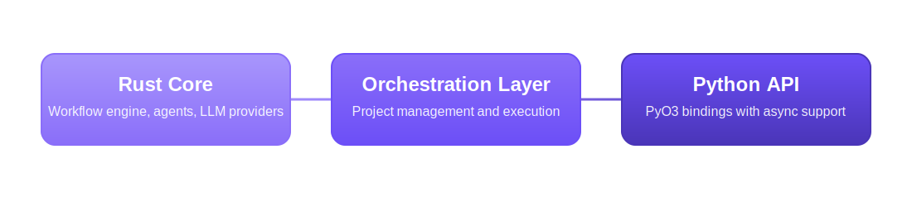

    

<h1 align="center" style="margin: 20px 0; color: #6C4FF7; font-size: 2.5rem; font-weight: 700;">GraphBit</h1>

High Performance AI agent Framework

# GraphBit Documentation

Welcome to the comprehensive documentation for **GraphBit** - a high-performance AI agent framework that combines Rust's performance with Python's ease of use.

## Quick Navigation

### 🚀 Getting Started
- [Installation Guide](getting-started/installation.md) - Install GraphBit on your system
- [Dependency Installation](getting-started/dependency-installation.md) - Install dependencies for different scenarios
- [Quick Start Tutorial](getting-started/quickstart.md) - Build your first workflow in 5 minutes
- [Basic Examples](getting-started/examples.md) - Simple examples to get you started

### 📚 User Guide
- [Core Concepts](user-guide/concepts.md) - Understand workflows, agents, and nodes
- [Workflow Builder](user-guide/workflow-builder.md) - Creating and connecting workflow nodes
- [Agent Configuration](user-guide/agents.md) - Setting up AI agents with different capabilities
- [Document Loader](user-guide/document-loader.md) - Loading and processing documents (PDF, DOCX, TXT, etc.)
- [Text Splitters](user-guide/text-splitters.md) - Processing large documents with various splitting strategies
- [LLM Providers](user-guide/llm-providers.md) - Working with OpenAI, Anthropic, Ollama, and more
- [Dynamic Graph Generation](user-guide/dynamics-graph.md) - Auto-generating workflow structures
- [Data Validation](user-guide/validation.md) - Input validation and data quality checks
- [Performance Optimization](user-guide/performance.md) - Tuning for speed and efficiency
- [Monitoring & Observability](user-guide/monitoring.md) - Metrics collection and debugging
- [Embeddings & Vector Search](user-guide/embeddings.md) - Text embeddings and similarity search
- [Reliability & Fault Tolerance](user-guide/reliability.md) - Circuit breakers, retries, and error handling

### 🔧 API Reference
- [Python API](api-reference/python-api.md) - Complete Python API documentation
- [Configuration Options](api-reference/configuration.md) - All configuration parameters
- [Node Types](api-reference/node-types.md) - Agent, condition, transform, and delay nodes

### 🔗 Connectors & Integrations
- [AWS Boto3](connector/aws_boto3.md) - Amazon Web Services integration
- [Azure](connector/azure.md) - Microsoft Azure services integration
- [Google Cloud Platform](connector/google_cloud_platform.md) - Google Cloud services integration
- [Vector Databases](connector/pinecone_integration.md) - Pinecone, Qdrant, ChromaDB, and more

### 🛠️ Development
- [Architecture Overview](development/architecture.md) - System design and components
- [Contributing Guide](development/contributing.md) - How to contribute to GraphBit
- [Python Bindings](development/python-bindings.md) - Python-Rust integration details
- [Debugging](development/debugging.md) - Troubleshooting and debugging workflows

### 📋 Examples & Use Cases
- [Content Generation Pipeline](examples/content-generation.md) - Multi-agent content creation
- [Data Processing Workflow](examples/data-processing.md) - ETL pipelines with AI agents
- [LLM Integration](examples/llm-integration.md) - Working with different language models
- [Semantic Search](examples/semantic-search.md) - Building intelligent search systems
- [Comprehensive Pipeline](examples/comprehensive-pipeline.md) - End-to-end workflow examples

## What is GraphBit?

GraphBit is a declarative framework for building reliable AI agent workflows with strong type safety, comprehensive error handling, and predictable performance. It features:

- **🔒 Type Safety** - Strong typing throughout the execution pipeline
- **🛡️ Reliability** - Circuit breakers, retry policies, and error handling  
- **🤖 Multi-LLM Support** - OpenAI, Anthropic, Ollama
- **⚡ Performance** - Rust core with Python bindings for optimal speed
- **📊 Observability** - Built-in metrics and execution tracing
- **🔧 Resource Management** - Concurrency controls and memory optimization

## Architecture

GraphBit uses a three-tier architecture:

## Community & Support

- **GitHub**: [github.com/InfinitiBit/graphbit](https://github.com/InfinitiBit/graphbit)
- **Issues**: Report bugs and request features
- **Discussions**: Ask Questions and Share ideas
- **Contributing**: See Our [contributing guide](development/contributing.md)

---

*Ready to build your first AI workflow? Start with GraphBit's [Quick Start Tutorial](getting-started/quickstart.md)!* 
